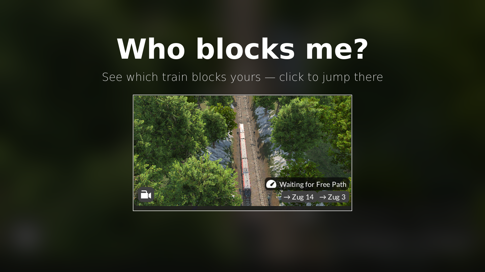

# Who's in my way?

A Transport Fever 3 mod that tells you which train is blocking yours.

When a train's vehicle window shows **"Waiting for Free Path"**, the mod adds a row of clickable train names below it: the train blocking yours, the train blocking that one, and so on. Clicking a name opens that train's window. If the chain loops back on itself (a deadlock), it is marked with **↺**. The chain is capped at 19 names, followed by "…".

## Installation

- **mod.io / in-game Mod Hub:** subscribe to "Who's in my way?" and enable it for your game.
- **Manual:** copy the `whoblocksme_1` folder into your mods folder and restart the game:
  - Linux: `~/.local/share/Transport Fever 3/mods/`
  - Windows: the `mods` folder inside the Transport Fever 3 userdata directory

## How it works

Transport Fever 3 does not expose which vehicle is blocking a waiting train. The mod therefore walks the train's planned path ahead of it and looks for track edges occupied by another train. If nothing is found that way, it falls back to `transportVehicleSystem.getVehicles` on the edges ahead. It then repeats the search from the blocking train to build the chain.

## Known limitations

- Blocks caused only by a path reservation, without the track actually being occupied, are not detected.
- The game may hide windows opened by clicking a train name. Pin the window to keep it open.

## Development

- Start the game in debug mode to get the in-game console (open it with `^`).
- Hot-reload the mod scripts with `AltGr+Shift+R`.
- Set `local DEBUG = true` in `whoblocksme_1/content/whoblocksme.script.tl` to log what the search finds for each train (logged only when it changes).
- Log output goes to `crash_dump/stdout.txt` in the game's userdata folder.

## License

MIT, see [LICENSE](LICENSE).

---

## Deutsch

**Wer steht mir im Weg?** zeigt im Fahrzeugfenster eines Zugs mit „Warte auf freie Wege“ die Kette der blockierenden Züge als anklickbare Namen. Ein Klick öffnet das Fenster des jeweiligen Zugs, ein Kreis (Deadlock) wird mit ↺ markiert, nach 19 Namen folgt „…“.

Installation über mod.io bzw. den Mod Hub im Spiel, oder manuell den Ordner `whoblocksme_1` nach `~/.local/share/Transport Fever 3/mods/` (Linux) bzw. in den `mods`-Ordner der Userdata (Windows) kopieren und das Spiel neu starten.

Grenzen: Reine Reservierungen ohne Gleisbelegung werden nicht erkannt. Geöffnete Fenster blendet das Spiel ggf. aus; zum Behalten anheften.
